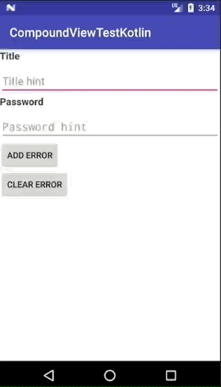

# Compound view example in Kotlin

This is an example project to show how to use the compound views in Android with Kotlin.

* [MyEditText class](app/src/main/java/com/gianlucaparadise/compoundviewexamplekotlin/views/MyEditText.kt)
* [MyEditText layout](app/src/main/res/layout/view_myedittext.xml)

[Here](https://github.com/gianlucaparadise/compound-view-example-xamarin) the Xamarin version.

## Result

### User interaction



### Usage in codebase

```xml
<?xml version="1.0" encoding="utf-8"?>
<LinearLayout
	xmlns:android="http://schemas.android.com/apk/res/android"
	xmlns:app="http://schemas.android.com/apk/res-auto"
	xmlns:tools="http://schemas.android.com/tools"
	android:layout_width="match_parent"
	android:layout_height="match_parent"
	android:orientation="vertical"
	tools:context="com.gianlucaparadise.compoundviewexamplekotlin.MainActivity">

	<com.gianlucaparadise.compoundviewexamplekotlin.views.MyEditText
		android:id="@+id/testMyEditText"
		android:layout_width="match_parent"
		android:layout_height="wrap_content"
		app:title="@string/test_title"
		app:inputHint="@string/test_hint"
		/>

	<com.gianlucaparadise.compoundviewexamplekotlin.views.MyEditText
		android:id="@+id/testPasswordMyEditText"
		android:layout_width="match_parent"
		android:layout_height="wrap_content"
		app:title="@string/password"
		app:inputHint="@string/password_hint"
		app:inputType="password"
		app:input="@string/password"
		/>

	<Button
		android:id="@+id/btnAddError"
		android:layout_width="wrap_content"
		android:layout_height="wrap_content"
		android:text="@string/add_error"/>

	<Button
		android:id="@+id/btnClearError"
		android:layout_width="wrap_content"
		android:layout_height="wrap_content"
		android:text="@string/clear_error"/>

</LinearLayout>
```

## Why should I use compound views?

A compound view lets you incapsulate and easily reuse the complex logic of a portion of UI.
